# Architecture

A walk-through of how `github.com/makegov/tango-go` is laid out, why it is shaped the way it is, and what happens when you call a method on `*Client`. Read this first if you want to extend the SDK; the other docs are reference material.

## Package layout

```text
github.com/makegov/tango-go            (package tango)
├── client.go              # Client struct + NewClient + observability accessors
├── options.go             # Functional options (With*)
├── transport.go           # HTTP, auth, retries, rate-limit parsing
├── errors.go              # Typed error tree + IsRetryable
├── pagination.go          # PaginatedResponse[T] + Iterator[T] (+ Seq)
├── internal.go            # ListOptions + listGeneric/getGeneric/postGeneric/patchGeneric
├── shapes.go              # 21 Shape* constants + DefaultBaseURL
├── version.go             # const Version
├── models.go              # Typed return/input models (AgencyRecord, WebhookEndpoint, ...)
├── contracts.go           # ListContracts + IterateContracts
├── entities.go            # ListEntities + GetEntity + IterateEntities
├── entity_subresources.go # ListEntityContracts / IDVs / OTAs / OTIDVs / Subawards / Lcats
├── idvs.go                # ListIDVs + GetIDV + IterateIDVs
├── idv_subresources.go    # ListIDVAwards / ChildIDVs / Transactions / Summary / Lcats
├── vehicles.go            # ListVehicles + GetVehicle + IterateVehicles
├── vehicle_subresources.go# ListVehicleAwardees + ListVehicleOrders
├── opportunities.go       # Opportunities / Notices / Forecasts / Grants + iterators
├── attachment_search.go   # SearchOpportunityAttachments
├── lookups.go             # Agencies, Organizations, NAICS, PSC, Subawards, Version
├── agency_subresources.go # ListAgencyAwardingContracts / FundingContracts
├── offices.go             # ListOffices + GetOffice
├── departments.go         # ListDepartments + GetDepartment (deprecated upstream)
├── business_types.go      # ListBusinessTypes + GetBusinessType
├── mas_sins.go            # ListMasSins + GetMasSin
├── assistance_listings.go # ListAssistanceListings + GetAssistanceListing
├── otas.go                # OTAs / OTIDVs / OTIDV Awards (+ iterators)
├── protests.go            # Protests (typed *ProtestRecord on GetProtest)
├── itdashboard.go         # IT Dashboard investments
├── gsa.go                 # GSA eLibrary contracts
├── lcats.go               # ListLcats router → entity or IDV sub-resource
├── metrics.go             # GetNAICSMetrics / GetPSCMetrics / GetEntityMetrics + ListMetrics
├── api_keys.go            # ListAPIKeys
├── webhooks_api.go        # Webhook endpoint + alert CRUD (server side)
└── webhooks/              # SUBPACKAGE — signing + verification
    ├── signing.go         # Generate / Verify / Parse
    └── handler.go         # VerifyRequest + Middleware
```

There are exactly two packages:

- **`tango`** (everything at root) — the API client. Roughly 94 exported methods on `*Client`, plus typed errors, options, paginated responses, and the shape preset constants.
- **`tango/webhooks`** (one subdirectory) — HMAC-SHA256 signing + verification helpers, with no dependency on the API client. A webhook receiver that only needs to verify deliveries can import this package alone.

### Why flat-at-root?

Idiomatic Go (think `slack-go/slack`, `google/go-github`, the `net/http` standard library) puts all of the package surface at one level. The alternative — Stripe-style sub-packages per resource (`tango/contracts`, `tango/entities`, ...) — would force callers to write `contracts.New(...)`, fragment the documentation, and make discoverability worse for a single-product SDK with ~94 methods. Flat scales fine well past that.

The only justified subpackage is `webhooks/` because signature verification has a fundamentally different consumer profile: a webhook receiver service shouldn't pull the HTTP client, the retry loop, the rate-limit state machine, or any of the resource methods just to compute an HMAC. (See [`decisions.md` D-03 / D-14](../../.mg-tools/scratch/) in this session's scratch for the long-form rationale.)

### Typed structs vs. `Record`

Most list/get methods return `Record` (an alias for `map[string]any`) or `*PaginatedResponse[Record]`. The dynamic-shape feature means the response schema varies per call — generating a typed struct per shape is unprofitable.

A small hand-picked set of methods return typed structs where the sibling SDKs already define them and the schema is stable:

| Method | Return type |
| ------ | ----------- |
| `GetAgency` | `*AgencyRecord` |
| `GetProtest` | `*ProtestRecord` |
| `Resolve` | `*ResolveResult` (with `[]ResolveCandidate`) |
| `Validate` | `*ValidateResult` |
| `ListWebhookEndpoints` / `GetWebhookEndpoint` / `CreateWebhookEndpoint` / `UpdateWebhookEndpoint` | `*WebhookEndpoint` |
| `ListWebhookAlerts` / `GetWebhookAlert` / `CreateWebhookAlert` / `UpdateWebhookAlert` | `*WebhookAlert` |
| `ListWebhookEventTypes` | `*WebhookEventTypesResponse` |
| `GetWebhookSamplePayload` | `*WebhookSamplePayloadResponse` |
| `TestWebhookEndpoint` | `*WebhookTestDeliveryResult` |

Every typed struct carries an `Extra map[string]any` field populated by a custom `UnmarshalJSON` so forward-compatible fields the server adds are preserved without dropping back to `Record`. See `models.go` for the pattern.

## Major components

### Client

`Client` is the entry point. Construct one with `NewClient(opts...)` and pass it around — it is safe for concurrent use across goroutines. Internally, it holds a `clientConfig` (resolved options) and a `rateLimitState` snapshot of the last-seen rate-limit headers.

There is no notion of per-request configuration that lives on the client (timeouts, retries, etc., are all resolved at construction). To deviate from the defaults on a specific call, construct a new client.

### Transport

`transport.go` owns the request loop: build URL → marshal body → set headers (`X-API-KEY`, `User-Agent`, `Accept`/`Content-Type`) → execute → read body → snapshot rate-limit headers → map status to the correct error type.

Retries are baked in (`(*Client).do` runs `attempt` up to `retries+1` times). A request is retried when the response is `5xx`, `408`, or `429`, or when the transport itself errors (network, timeout). Backoff is exponential (250ms × 2^attempt) capped at 10s; if the server sets `Retry-After`, that wins (still capped at 10s).

`do` returns the raw body bytes. Callers decode it themselves through the generic helpers in `internal.go` (so the transport stays free of generic type machinery).

### Error model

All HTTP-layer failures surface as one of:

- `*APIError` — base type; carries `StatusCode`, `Message`, `ResponseData`.
- `*AuthError` (401), `*NotFoundError` (404), `*ValidationError` (400), `*RateLimitError` (429), `*TimeoutError` — typed children that embed `*APIError`.

Every typed child implements `Unwrap() error`, so `errors.As(err, &tango.NotFoundError{})` and `errors.As(err, &tango.APIError{})` both work. `IsRetryable(err) bool` exposes the retry decision the SDK uses internally, in case a caller wants to drive its own retry policy on top.

### Pagination

`PaginatedResponse[T]` is the standard envelope (count, next, previous, page_metadata, results). The `Cursor` field is extracted from the `next` URL for keyset-paginated endpoints.

`Iterator[T]` walks every page of a paginated endpoint. Its interface is the canonical Go iteration pattern:

```go
for it.Next() {
    item := it.Item()
    // ...
}
if err := it.Err(); err != nil { /* ... */ }
```

It also exposes `Seq() iter.Seq2[T, error]` for Go 1.23+ range-over-func:

```go
for item, err := range it.Seq() {
    if err != nil { return err }
    // ...
}
```

The iterator auto-detects whether the server uses `?page=` or `?cursor=` based on the `next` URL it returns, so the same iterator works for both pagination styles.

### Shapes

`shapes.go` defines `DefaultBaseURL` and 21 `Shape*` constants that match the `ShapeConfig.*` enums in the Node and Python SDKs. Pass any of them (or your own comma-separated field selector) via the `Shape` field on a list/get options struct. See [`SHAPES.md`](SHAPES.md) for the field-selector grammar.

### Webhooks subpackage

`webhooks/` is independently importable. It exposes:

- `Generate(body, secret) string` — produce a wire-format `sha256=<hex>` signature.
- `Verify(body, header, secret) bool` — constant-time check; never panics.
- `Parse(header) (ParsedSignature, bool)` — decompose a header for debugging.
- `VerifyRequest(r, secret) ([]byte, error)` — read + verify an `*http.Request`, with body reset so downstream handlers can re-read.
- `Middleware(secret, next) http.Handler` — `http.Handler` wrapper that rejects unsigned requests with 401.

CRUD operations against the webhook _resource_ (create/list/update/delete endpoints + alerts on the server) are in the root package via `*Client.{List,Get,Create,Update,Delete}Webhook{Endpoint,Alert}` — separate concern, separate dependency footprint.

## Request lifecycle

Below is what happens when you call `client.ListContracts(ctx, opts)`:

```mermaid
sequenceDiagram
    autonumber
    actor C as Caller
    participant M as Client.ListContracts
    participant Q as opts.toQuery()
    participant T as Client.do (retry loop)
    participant A as Client.attempt
    participant H as net/http
    participant P as decodePaginated[Record]

    C->>M: ListContracts(ctx, opts)
    M->>Q: build url.Values
    Q-->>M: q (filter + page + shape)
    M->>T: requestSpec{GET, /api/contracts/, q}
    loop up to retries+1
        T->>A: attempt(ctx, spec)
        A->>A: buildURL + set X-API-KEY, User-Agent
        A->>H: httpClient.Do(req)
        H-->>A: resp / error
        A->>A: snapshot rate-limit headers
        alt 2xx
            A-->>T: raw bytes
            T-->>M: success
        else 4xx/5xx/timeout
            A-->>T: typed *APIError variant
            alt IsRetryable && attempt < max
                T->>T: sleep min(Retry-After, 250ms·2^n, 10s)
            else
                T-->>M: err
                M-->>C: err
            end
        end
    end
    M->>P: decodePaginated[Record](raw)
    P-->>M: *PaginatedResponse[Record]
    M-->>C: response, nil
```



A few details worth knowing:

- **Per-request context.** `attempt` wraps the caller's context with `context.WithTimeout(ctx, cfg.timeout)` when a timeout is configured. Caller-cancellation propagates normally; timeouts surface as `*TimeoutError`.
- **Body reads happen before status interpretation.** The body is read in full and the headers are snapshotted before any error variant is constructed. That keeps `client.RateLimitInfo()` and `client.LastResponseHeaders()` populated even when the call ends in an error.
- **Retries are at the request level, not the page level.** Pagination is built on top of the request layer, so each `Iterator.Next()` call retries independently.

## Extending the SDK

If you're adding a new resource method, the pattern is:

1. **Define `List<Resource>Options` and a `toQuery() url.Values` method** that maps your typed fields to the canonical wire keys. Embed `ListOptions` for pagination + shape control unless the endpoint doesn't support it.
2. **Define the public `Client.List<Resource>` (and `Get<Resource>` if applicable)** as thin wrappers over `listGeneric[Record]` / `getGeneric[Record]` in `internal.go`. Validation of required path segments goes here, before the network call.
3. **Add `Iterate<Resource>`** if the endpoint paginates and walking it is useful. Re-use the existing pattern (closure that re-runs the list call with `Page` / `Cursor` swapped in).
4. **Don't add a new file unless the resource is large.** Sub-resources of an existing resource live next to it (e.g. `idv_subresources.go` next to `idvs.go`). Aim for files to stay under ~400 lines.
5. **Godoc every export.** Start the comment with the symbol name; mention the endpoint path in parens for `*Client` methods.

If you find yourself reaching for an external dependency, stop. The library is stdlib-only and that's a design constraint — see [`decisions.md` D-18](../../.mg-tools/scratch/) for the rationale.

## Versioning

The current version is in `version.go` (`const Version`). The user-agent defaults to `tango-go/<Version>`. The constant is the single source of truth at the Go level; the git tag is the source of truth for `go get`.
